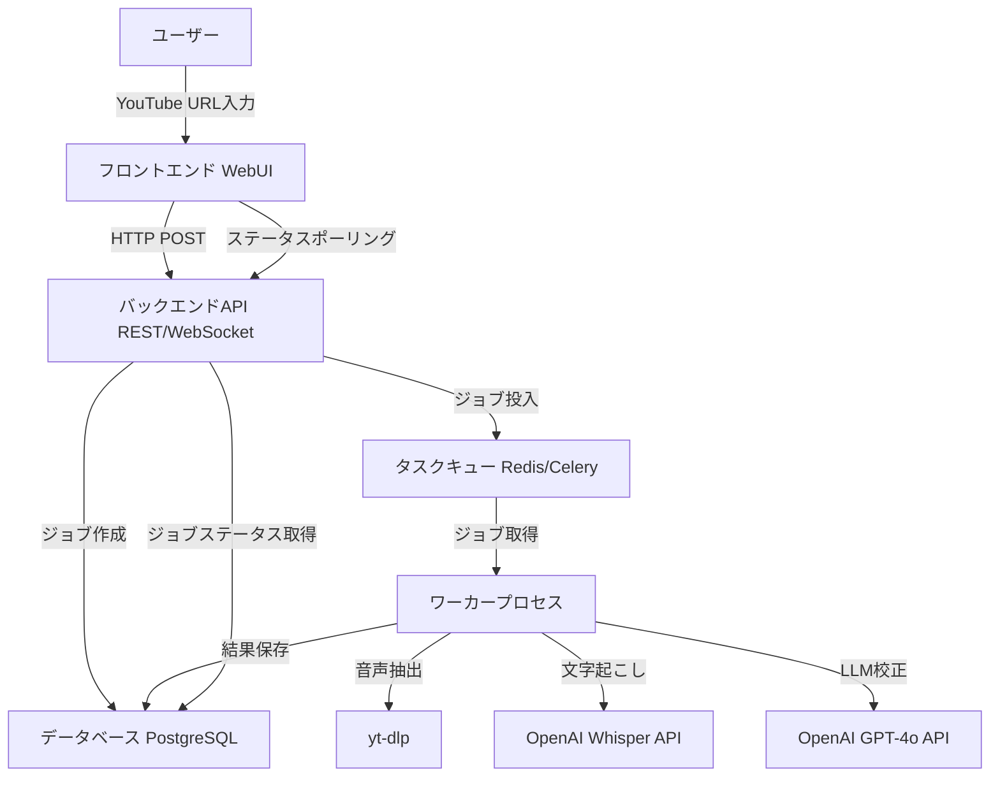
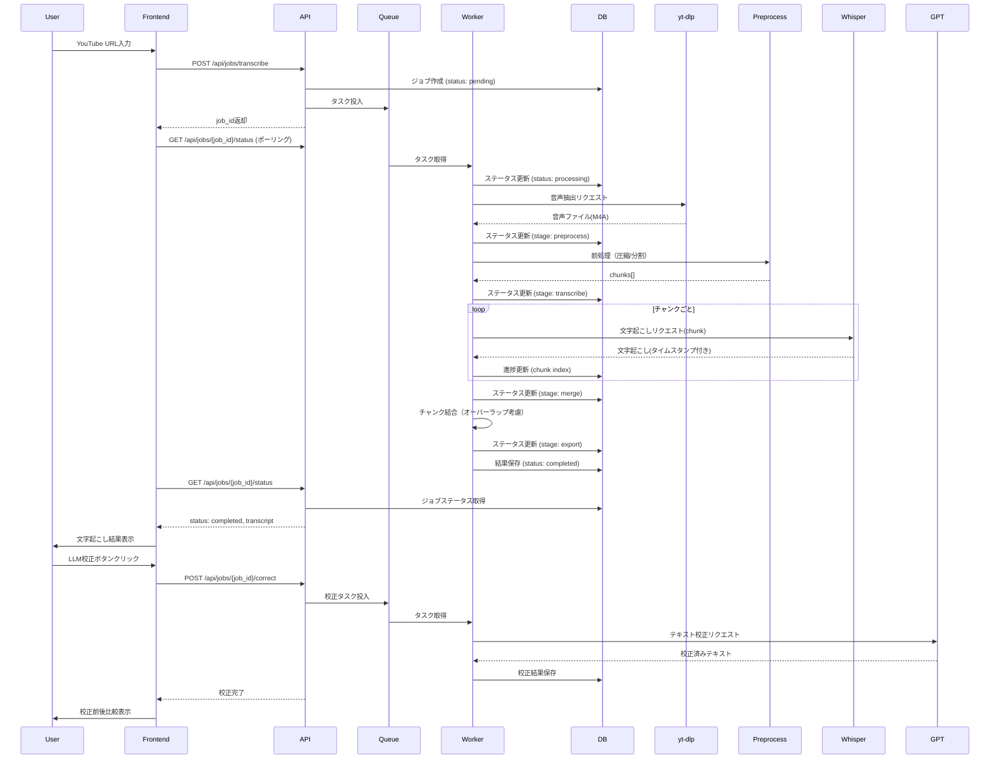
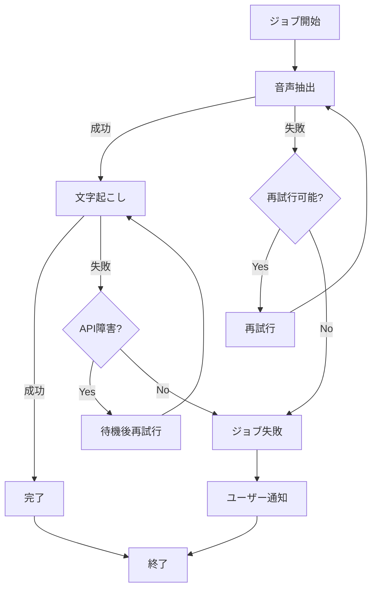

# 設計ドキュメント

## 概要

**目的**: 本機能は、YouTube動画の音声を抽出し、日本語・英語の高品質な文字起こしとLLM校正を提供することで、動画コンテンツのテキスト化を実現します。

**ユーザー**: 個人ユーザー、コンテンツクリエイター、教育関係者が、YouTube動画の内容を文字として保存・活用する際に利用します。

**影響**: 従来手動で行っていた文字起こし作業を自動化し、時間を大幅に削減します。LLM校正により、読みやすく正確なテキストを提供します。

### ゴール
- YouTube URLから音声を自動抽出し、文字起こしを実行する
- 日本語・英語の両言語に対応した高精度な文字起こしを提供する
- LLMによる校正機能で、誤変換を修正し読みやすいテキストを生成する
- 複数のエクスポート形式（TXT、SRT、VTT）をサポートする
- 成功基準: 10分の動画を5分以内で処理完了、文字起こし精度90%以上

### 非ゴール
- リアルタイムストリーミング動画の処理（録画済み動画のみ対象）
- 60分を超える長時間動画の処理（将来対応予定）
- 動画編集・加工機能
- 複数動画の一括処理（初期版は単一動画のみ）

## アーキテクチャ

> 詳細な調査ノートは `research.md` を参照してください。設計ドキュメントは、すべての決定事項と契約を含む自己完結型のレビュー資料として構成されています。

### アーキテクチャパターンと境界マップ

**アーキテクチャ統合**:
- **選択パターン**: 非同期キューアーキテクチャ (Async Queue Pattern)
- **合理性**: 2〜5分の処理時間を要するため、同期処理は不適切。タスクキューによる非同期処理でユーザー体験を向上。
- **ドメイン/機能境界**: 
  - **UI層**: ユーザーインタラクション、ジョブステータス表示
  - **API層**: リクエスト受付、ジョブ管理、結果取得
  - **ワーカー層**: 音声抽出、文字起こし、LLM校正の実行
  - **データ層**: ジョブステート、結果テキスト、メタデータの永続化
- **既存パターンの保持**: 新規プロジェクトのため該当なし
- **新コンポーネント合理性**: 
  - フロントエンド: ユーザーインタラクションと進捗表示
  - バックエンドAPI: ジョブのオーケストレーション
  - ワーカー: 長時間処理の非同期実行
  - データベース: ジョブ状態と結果の永続化
  - タスクキュー: ジョブ配信と再試行
- **ステアリング遵守**: テンプレート状態のため、今後具体的な技術スタックに従う



### 技術スタック

| レイヤー | 選択 / バージョン | 機能での役割 | 備考 |
|-------|------------------|-----------------|-------|
| Frontend / CLI | React 18+ / Next.js 14+ | WebUIの提供、ユーザーインタラクション | レスポンシブデザイン対応 |
| Backend / Services | Python 3.10+, FastAPI | REST API提供、ジョブ管理 | 非同期処理対応 |
| Task Queue | Celery + Redis | 非同期ジョブ処理 | ワーカープロセスとの連携 |
| Data / Storage | PostgreSQL 14+ | ジョブステート、結果保存 | JSON型でメタデータ保存 |
| Audio Extraction | yt-dlp (Python library) | YouTube音声ダウンロード | 最新版を使用、定期更新 |
| Speech-to-Text | OpenAI Whisper API (gpt-4o-mini-transcribe) | 音声→テキスト変換 | 必要に応じてgpt-4o-transcribeにアップグレード |
| LLM Correction | OpenAI GPT-4o-mini API | テキスト校正 | プロンプトエンジニアリング適用 |
| Infrastructure / Runtime | Docker, Docker Compose | コンテナ化、ローカル開発環境 | 本番環境はKubernetes想定 |

> 合理性の要約はここに記載し、詳細な調査（トレードオフ、ベンチマーク）は `research.md` の対応セクションを参照してください。

- **yt-dlp選択理由**: 積極的なメンテナンス、YouTube互換性、メタデータ抽出機能
- **Whisper API選択理由**: 高精度、日英対応、ストリーミングサポート、gpt-4o-miniでコスト最適化
- **非同期キュー選択理由**: 長時間処理に適し、水平スケール可能、リトライロジック内蔵

## システムフロー

### シーケンス図: 文字起こしリクエストフロー



**フロー主要決定事項**:
- ポーリングによるステータス確認（WebSocketは将来拡張）
- 校正は別ジョブとして実行（ユーザー選択制）
- 各処理ステージでDB更新により進捗を追跡可能
 - OpenAIアップロード制限（最大25MB）に備え、音声前処理（圧縮/分割）をワーカー内に追加

## 要件トレーサビリティ

| 要件 | 概要 | コンポーネント | インターフェース | フロー |
|-------------|---------|------------|------------|-------|
| 1.1, 1.2, 1.3, 1.4 | YouTube動画入力 | Frontend, URLValidator | InputForm | URL入力フロー |
| 2.1, 2.2, 2.3, 2.4, 2.5 | 音声ダウンロード | AudioExtractor, yt-dlp | AudioExtractionService | 音声抽出フロー |
| 3.1, 3.2, 3.3, 3.4, 3.5 | 日本語文字起こし | TranscriptionService, Whisper API | TranscriptionService | 文字起こしフロー |
| 4.1, 4.2, 4.3, 4.4, 4.5 | 英語文字起こし | TranscriptionService, Whisper API | TranscriptionService | 文字起こしフロー |
| 5.1, 5.2, 5.3, 5.4 | 結果管理 | ResultManager, ExportService | ExportService | エクスポートフロー |
| 6.1, 6.2, 6.3, 6.4 | ユーザーインターフェース | Frontend, UI Components | UIService | 全フロー |
| 7.1, 7.2, 7.3, 7.4, 7.5, 7.6, 7.7, 7.8 | LLM校正 | CorrectionService, GPT API | CorrectionService | 校正フロー |
| 8.1, 8.2, 8.3, 8.4 | パフォーマンス | Queue, Worker Pool | QueueService | 全フロー |

## コンポーネントとインターフェース

### コンポーネント概要

| コンポーネント | ドメイン/レイヤー | 意図 | 要件カバレッジ | 主要依存関係 (重要度) | 契約 |
|-----------|--------------|--------|--------------|--------------------------|-----------|
| WebUI | Frontend/Presentation | ユーザーインタラクション提供 | 1, 5, 6, 7 | APIClient (P0) | State |
| APIService | Backend/API | ジョブ管理、リクエスト処理 | 全要件 | JobManager (P0), Queue (P0) | API |
| JobManager | Backend/Core | ジョブライフサイクル管理 | 全要件 | Database (P0) | Service |
| AudioExtractor | Worker/Processing | YouTube音声抽出 | 2 | yt-dlp (P0), FileStorage (P0) | Service |
| AudioPreprocessor | Worker/Processing | 音声の圧縮/分割でアップロード制限内に収める | 9, 10 | ffmpeg (P0), FileStorage (P0) | Service |
| TranscriptionService | Worker/Processing | 音声→テキスト変換 | 3, 4 | Whisper API (P0), FileStorage (P0) | Service |
| CorrectionService | Worker/Processing | LLMテキスト校正 | 7 | GPT API (P0) | Service |
| ExportService | Backend/Processing | 複数形式エクスポート | 5 | FileFormatter (P1) | Service |
| QueueService | Infrastructure/Queue | タスク配信・再試行 | 8 | Redis (P0), Celery (P0) | Service |

### Frontend / UI Layer

#### WebUI

| フィールド | 詳細 |
|-------|--------|
| 意図 | ユーザーインタラクション、進捗表示、結果管理 |
| 要件 | 1, 5, 6, 7 |
| 所有者/レビュアー | Frontend Team |

**責任と制約**
- YouTube URL入力フォーム提供
- ジョブステータスのポーリングと表示
- 文字起こし結果の表示と編集
- LLM校正トリガーと前後比較
- エクスポート機能UI

**依存関係**
- Outbound: APIClient — REST API呼び出し (P0)
- Outbound: WebSocket Client — リアルタイム更新（将来拡張） (P2)

**契約**: State [ ] / API [ ] / Event [ ] / Batch [ ] / State [✓]

##### State Management

- **State model**: 
  - `transcriptionJob`: 現在処理中のジョブ情報
  - `jobStatus`: pending | processing | completed | failed
  - `transcript`: 文字起こしテキスト
  - `correctedTranscript`: 校正済みテキスト（オプション）
  - `showComparison`: 校正前後比較表示フラグ

- **Persistence & consistency**: LocalStorage（ジョブID保存）、API経由でサーバーと同期

- **Concurrency strategy**: 単一ジョブのみアクティブ（複数ジョブは将来対応）

**実装ノート**
- Integration: React + Next.js、TailwindCSSでレスポンシブデザイン
- Validation: URL形式検証はフロントとバックエンド両方で実施
- Risks: ポーリング頻度調整が必要（サーバー負荷考慮）

### Backend / API Layer

#### APIService

| フィールド | 詳細 |
|-------|--------|
| 意図 | REST APIエンドポイント提供、リクエスト検証、ジョブオーケストレーション |
| 要件 | 全要件 |
| 所有者/レビュアー | Backend Team |

**責任と制約**
- YouTube URL検証
- ジョブ作成とキュー投入
- ジョブステータス問い合わせ
- 結果取得とエクスポート
- エラーハンドリングとレート制限

**依存関係**
- Inbound: Frontend — HTTP/JSON リクエスト (P0)
- Outbound: JobManager — ジョブCRUD操作 (P0)
- Outbound: QueueService — タスク投入 (P0)
- External: OpenAI API — API キークレデンシャル (P0)

**契約**: Service [ ] / API [✓] / Event [ ] / Batch [ ] / State [ ]

##### API Contract

| Method | Endpoint | Request | Response | Errors |
|--------|----------|---------|----------|--------|
| POST | /api/jobs/transcribe | `{ "youtube_url": string, "language": "ja"\|"en", "model": string }` | `{ "job_id": string, "status": string }` | 400 (無効URL), 422 (処理不可), 500 (サーバーエラー) |
| GET | /api/jobs/{job_id}/status | - | `{ "job_id": string, "status": string, "progress": number, "result"?: object }` | 404 (ジョブ不存在), 500 |
| POST | /api/jobs/{job_id}/correct | - | `{ "correction_job_id": string, "status": string }` | 404, 422 (文字起こし未完了), 500 |
| GET | /api/jobs/{job_id}/result | `?format=txt\|srt\|vtt` | `{ "transcript": string, "corrected_transcript"?: string, "metadata": object }` | 404, 500 |
| GET | /api/jobs/{job_id}/export | `?format=txt\|srt\|vtt` | File download (text/plain, application/x-subrip) | 404, 500 |

**実装ノート**
- Integration: FastAPIフレームワーク使用、OpenAPI自動生成
- Validation: Pydantic modelでリクエスト検証、YouTube URL正規表現チェック
- Risks: レート制限実装必要（同一IPから大量リクエスト防止）

#### JobManager

| フィールド | 詳細 |
|-------|--------|
| 意図 | ジョブのライフサイクル管理、データベースCRUD操作 |
| 要件 | 全要件 |

**責任と制約**
- ジョブレコードのCRUD操作
- ステータス遷移管理
- ジョブメタデータ保存
- トランザクション境界管理

**依存関係**
- Inbound: APIService — ジョブ操作リクエスト (P0)
- Inbound: Worker — ステータス更新 (P0)
- Outbound: Database — PostgreSQL接続 (P0)

**契約**: Service [✓] / API [ ] / Event [ ] / Batch [ ] / State [ ]

##### Service Interface

```python
from typing import Optional, Dict, Any
from enum import Enum

class JobStatus(Enum):
    PENDING = "pending"
    PROCESSING = "processing"
    TRANSCRIBING = "transcribing"
    CORRECTING = "correcting"
    COMPLETED = "completed"
    FAILED = "failed"

class JobStage(Enum):
    DOWNLOAD_EXTRACT = "download_extract"
    PREPROCESS = "preprocess"
    TRANSCRIBE = "transcribe"
    MERGE = "merge"
    EXPORT = "export"

class JobManager:
    def create_job(self, youtube_url: str, language: str, model: str) -> str:
        """新規ジョブを作成し、ジョブIDを返す"""
        pass
    
    def get_job_status(self, job_id: str) -> Dict[str, Any]:
        """ジョブのステータスと進捗を取得

        互換性のため status/progress は維持しつつ、必要に応じて stage/stage_detail を返す。
        - stage: download_extract|preprocess|transcribe|merge|export
        - stage_detail: 例 {"chunk_index": 3, "chunk_count": 12, "chunk_size_bytes": 1234567}
        """
        pass
    
    def update_job_status(
        self,
        job_id: str,
        status: JobStatus,
        progress: int = 0,
        error: Optional[str] = None,
        stage: Optional[JobStage] = None,
        stage_detail: Optional[Dict[str, Any]] = None,
    ) -> None:
        """ジョブステータスを更新"""
        pass
    
    def save_job_result(self, job_id: str, transcript: str, metadata: Dict[str, Any]) -> None:
        """ジョブ結果を保存"""
        pass
    
    def get_job_result(self, job_id: str) -> Dict[str, Any]:
        """ジョブ結果を取得"""
        pass
```

- **事前条件**: ジョブIDが有効であること、データベース接続が確立されていること
- **事後条件**: ジョブステータスがデータベースに永続化されること
- **不変条件**: ジョブステータス遷移が論理的に正しいこと（pending → processing → completed/failed）

**実装ノート**
- Integration: SQLAlchemy ORMでデータベースアクセス
- Validation: ステータス遷移の整合性チェック
- Risks: 並行アクセスによるステータス競合（楽観的ロック使用）

### Worker / Processing Layer

#### AudioExtractor

| フィールド | 詳細 |
|-------|--------|
| 意図 | YouTube動画から音声を抽出し、ファイルシステムに保存 |
| 要件 | 2 |

**責任と制約**
- YouTube URL検証
- yt-dlpライブラリ経由で音声抽出
- 音声ファイル（M4A/MP3）をローカルストレージに保存
- エラーハンドリング（著作権制限、動画不在、ネットワークエラー）

**依存関係**
- External: yt-dlp — YouTube音声ダウンロード (P0)
- Outbound: FileStorage — ファイル保存 (P0)
- Outbound: JobManager — ステータス更新 (P0)

**契約**: Service [✓] / API [ ] / Event [ ] / Batch [ ] / State [ ]

##### Service Interface

```python
from dataclasses import dataclass
from typing import Optional

@dataclass
class AudioExtractionResult:
    success: bool
    file_path: Optional[str]
    duration_seconds: Optional[int]
    title: Optional[str]
    error: Optional[str]

class AudioExtractor:
    def extract_audio(self, youtube_url: str, job_id: str) -> AudioExtractionResult:
        """YouTube URLから音声を抽出し、ファイルパスを返す"""
        pass
```

- **事前条件**: 有効なYouTube URL、十分なディスク容量
- **事後条件**: 音声ファイルが指定パスに保存される、または明確なエラーメッセージ
- **不変条件**: 同じjob_idで複数回呼び出されても冪等性を保つ（上書き）

**実装ノート**
- Integration: yt-dlpのPython APIを直接使用、`ydl.extract_info()`でメタデータ取得
- Validation: URL形式チェック、動画長チェック（60分制限）
- Risks: YouTube側の変更による互換性問題（yt-dlp定期更新で対応）

#### AudioPreprocessor

| フィールド | 詳細 |
|-------|--------|
| 意図 | 音声の圧縮/分割により、OpenAIアップロード制限内（デフォルト25MB）に収める |
| 要件 | 9, 10 |

**責任と制約**
- 音声ファイルのサイズ判定（MAX_UPLOAD_MB）
- サイズ超過時の前処理（圧縮・分割）
- 音声認識に適した設定（モノラル、16kHz/24kHz、安定したコーデック、音声向けビットレート）
- チャンク作成（オーバーラップ付与）とメタデータ生成
- ジョブ単位の作業ディレクトリ管理（成功/失敗時のクリーンアップ）

**依存関係**
- Inbound: Worker — 前処理リクエスト (P0)
- External: ffmpeg — 変換/分割 (P0)
- Outbound: FileStorage — ファイル入出力 (P0)
- Outbound: JobManager — 進捗・エラー更新 (P0)

**契約**: Service [✓] / API [ ] / Event [ ] / Batch [ ] / State [ ]

##### Data Structures

```python
from dataclasses import dataclass

@dataclass
class Chunk:
    path: str
    index: int
    start_offset_sec: float
    duration_sec: float
    size_bytes: int
```

##### Service Interface

```python
from dataclasses import dataclass
from typing import List, Optional, Literal

@dataclass
class PreprocessPlan:
    strategy: Literal["as_is", "compress", "compress_then_split"]
    input_size_bytes: int
    target_upload_bytes: int
    chunk_overlap_sec: float
    chunks: List[Chunk]

@dataclass
class PreprocessResult:
    success: bool
    plan: Optional[PreprocessPlan]
    error: Optional[str]

class AudioPreprocessor:
    def prepare_for_upload(self, audio_file_path: str, job_id: str) -> PreprocessResult:
        """アップロード制限に収まるように音声を前処理し、チャンク一覧を返す"""
        pass
```

##### アルゴリズム（決定事項）

**戦略決定（圧縮優先 → 分割）**
- まず安定した音声向け設定で圧縮（再サンプリング・モノラル化・固定ビットレート）し、その結果がTARGET_UPLOAD_MB未満なら単一ファイルで送信する。
- それでも超過する場合のみ、圧縮済みファイルを分割する。
- **合理性**: 入力（M4A/WebM等）はVBRでサイズ推定が難しく、先に圧縮してCBR相当へ寄せるとチャンクサイズ予測が安定し、チャンク数も減らせる。

**チャンク長プランニング（サイズ→時間）**
- 目標サイズ: `target_upload_bytes = TARGET_UPLOAD_MB * 1024 * 1024`
- 想定バイト/秒: `bytes_per_sec ≈ (AUDIO_BITRATE_KBPS * 1000) / 8`
- 安全マージン込みの最大チャンク長（概念）: `chunk_duration_sec = floor((target_upload_bytes * 0.98) / bytes_per_sec)`
- オーバーラップ: `CHUNK_OVERLAP_SEC`（デフォルト0.8秒）を各チャンクの前後に付与（先頭/末尾は境界に収める）

**結合と重複（制限付き）**
- テキスト結合はオーバーラップ区間の簡易重複除去（例: 先頭数十文字の一致でトリミング）を行う。
- 限界: 完全な話者同定・語彙正規化・高度なアラインメントは非ゴール。

**エラーハンドリングとクリーンアップ**
- 失敗時は「どのチャンク（index）が、どのステップで」失敗したかをエラーメッセージに含める。
- 作業ディレクトリは `job_id` 単位で作成し、成功時は保持/削除を設定可能とする（デフォルトは削除）。

#### TranscriptionService

| フィールド | 詳細 |
|-------|--------|
| 意図 | 音声ファイルをテキストに変換（日本語/英語対応） |
| 要件 | 3, 4 |

**責任と制約**
- 音声ファイルをOpenAI Whisper APIに送信
- 言語指定（日本語/英語）
- ストリーミング対応（進捗更新）
- 文字起こしテキストの保存
 - 大容量音声はAudioPreprocessorでチャンク化し、チャンクごとに文字起こしを実行

**依存関係**
- Inbound: Worker — 文字起こしリクエスト (P0)
- External: OpenAI Whisper API — 音声→テキスト変換 (P0)
- Outbound: FileStorage — 音声ファイル読み込み (P0)
- Outbound: JobManager — 進捗・結果更新 (P0)

外部依存の調査概要: Whisper APIはgpt-4o-mini-transcribeで最大25MBのファイルをサポート。詳細な制限とフォーマットは `research.md` を参照。

**契約**: Service [✓] / API [ ] / Event [ ] / Batch [ ] / State [ ]

##### Service Interface

```python
from dataclasses import dataclass
from typing import Optional, Literal

@dataclass
class TranscriptionResult:
    success: bool
    transcript: Optional[str]
    language_detected: Optional[str]
    duration_seconds: Optional[float]
    error: Optional[str]

class TranscriptionService:
    def transcribe(
        self, 
        audio_file_path: str, 
        language: Literal["ja", "en"],
        model: str = "gpt-4o-mini-transcribe",
        prompt: Optional[str] = None
    ) -> TranscriptionResult:
        """音声ファイルを文字起こし"""
        pass
```

- **事前条件**: 有効な音声ファイルパス、OpenAI APIキー設定
- **事後条件**: 文字起こしテキストが返却される、または明確なエラー
- **不変条件**: 同じ音声ファイルに対して一貫した文字起こし結果

**実装ノート**
- Integration: OpenAI Python SDK使用、ストリーミングモードで進捗更新
- Validation: アップロード上限（MAX_UPLOAD_MB）に対するサイズチェック、音声形式検証
- Risks: API レート制限、タイムアウト（リトライロジック実装）

#### CorrectionService

| フィールド | 詳細 |
|-------|--------|
| 意図 | LLMで文字起こしテキストを校正 |
| 要件 | 7 |

**責任と制約**
- 文字起こしテキストをGPT-4o-miniに送信
- 誤変換修正、句読点整形、段落整形、文法修正
- 校正前後のテキスト保存
- 校正指示プロンプトの管理

**依存関係**
- Inbound: Worker — 校正リクエスト (P0)
- External: OpenAI GPT API — テキスト校正 (P0)
- Outbound: JobManager — 校正結果保存 (P0)

**契約**: Service [✓] / API [ ] / Event [ ] / Batch [ ] / State [ ]

##### Service Interface

```python
from dataclasses import dataclass
from typing import Optional

@dataclass
class CorrectionResult:
    success: bool
    corrected_text: Optional[str]
    changes_summary: Optional[str]
    error: Optional[str]

class CorrectionService:
    def correct_transcript(
        self, 
        transcript: str, 
        language: Literal["ja", "en"]
    ) -> CorrectionResult:
        """文字起こしテキストを校正"""
        pass
```

- **事前条件**: 有効な文字起こしテキスト、OpenAI APIキー設定
- **事後条件**: 校正済みテキストが返却される
- **不変条件**: 元のテキストの意味を変えない

**実装ノート**
- Integration: OpenAI Chat Completions API使用、システムプロンプトで校正指示
- Validation: テキスト長チェック（トークン制限考慮）
- Risks: 過剰な校正で意味が変わる可能性（プロンプトチューニング必要）

#### ExportService

| フィールド | 詳細 |
|-------|--------|
| 意図 | 文字起こし結果を複数形式でエクスポート |
| 要件 | 5 |

**責任と制約**
- TXT形式エクスポート（プレーンテキスト）
- SRT形式エクスポート（字幕ファイル）
- VTT形式エクスポート（WebVTT字幕）
- タイムスタンプ付き字幕生成
 - チャンク分割された場合も、タイムスタンプをチャンク開始オフセットで補正して連続したSRT/VTTを生成

**依存関係**
- Inbound: APIService — エクスポートリクエスト (P0)
- Outbound: FileFormatter — 形式変換 (P1)
- Outbound: JobManager — 結果取得 (P0)

**契約**: Service [✓] / API [ ] / Event [ ] / Batch [ ] / State [ ]

##### Service Interface

```python
from dataclasses import dataclass
from typing import Literal

@dataclass
class ExportResult:
    success: bool
    file_content: str
    mime_type: str
    filename: str
    error: Optional[str]

class ExportService:
    def export(
        self, 
        job_id: str, 
        format: Literal["txt", "srt", "vtt"]
    ) -> ExportResult:
        """指定形式でエクスポート"""
        pass
```

- **事前条件**: 完了したジョブID、有効なフォーマット指定
- **事後条件**: 指定形式のファイルコンテンツが生成される
- **不変条件**: 同じジョブIDと形式で一貫した出力

**実装ノート**
- Integration: SRT/VTT生成ライブラリ（pysrt, webvttなど）
- Validation: タイムスタンプの整合性チェック
- Risks: タイムスタンプ情報がない場合の処理（均等配分）

### Infrastructure Layer

#### QueueService

| フィールド | 詳細 |
|-------|--------|
| 意図 | 非同期タスクの配信、再試行、スケジューリング |
| 要件 | 8 |

**責任と制約**
- タスクのキュー投入
- ワーカーへのタスク配信
- 失敗時の再試行ロジック
- タスク優先度管理

**依存関係**
- Inbound: APIService — タスク投入 (P0)
- Outbound: Redis — タスクキューストレージ (P0)
- Outbound: Celery — タスク配信エンジン (P0)
- Outbound: Worker — タスク実行 (P0)

**契約**: Service [✓] / API [ ] / Event [ ] / Batch [ ] / State [ ]

##### Service Interface

```python
from dataclasses import dataclass
from typing import Dict, Any

@dataclass
class TaskResult:
    task_id: str
    status: str

class QueueService:
    def enqueue_transcription_task(self, job_id: str, youtube_url: str, language: str, model: str) -> TaskResult:
        """文字起こしタスクをキューに投入"""
        pass
    
    def enqueue_correction_task(self, job_id: str, transcript: str, language: str) -> TaskResult:
        """校正タスクをキューに投入"""
        pass
    
    def get_task_status(self, task_id: str) -> Dict[str, Any]:
        """タスクステータスを取得"""
        pass
```

- **事前条件**: Redis接続が確立されていること
- **事後条件**: タスクがキューに永続化される
- **不変条件**: タスクは少なくとも1回は配信される（at-least-once delivery）

**実装ノート**
- Integration: Celery + Redis、ワーカープールサイズ調整
- Validation: タスク引数の検証
- Risks: キュー詰まり時の対応（優先度付けとタイムアウト）

## データモデル

### ドメインモデル

**アグリゲートとトランザクション境界**:
- **TranscriptionJob** アグリゲート: ジョブのライフサイクル全体を管理
  - Entities: Job (root), AudioFile, Transcript, CorrectedTranscript
  - Value Objects: JobStatus, LanguageCode, ModelName
  - Domain Events: JobCreated, AudioExtracted, TranscriptionCompleted, CorrectionCompleted

**ビジネスルールと不変条件**:
- ジョブは一度completedになったらfailedに戻れない
- 校正は文字起こし完了後のみ実行可能
- 1つのジョブに対して1つの音声ファイル、1つの文字起こし、最大1つの校正結果

### 論理データモデル

**構造定義**:

エンティティ関係とカーディナリティ:
- Job 1 : 1 AudioFile
- Job 1 : 1 Transcript
- Job 1 : 0..1 CorrectedTranscript
- Job 1 : N JobStatusHistory (監査用)

属性と型:
- Job: id (UUID), youtube_url (String), language (Enum), model (String), status (Enum), created_at (Timestamp), updated_at (Timestamp)
- AudioFile: id (UUID), job_id (FK), file_path (String), duration_seconds (Integer), format (String), file_size_bytes (Integer)
- Transcript: id (UUID), job_id (FK), text (Text), language_detected (String), transcription_model (String)
- CorrectedTranscript: id (UUID), job_id (FK), corrected_text (Text), original_text (Text), correction_model (String)

**一貫性と整合性**:
- トランザクション境界: Job作成とAudioFile作成は同一トランザクション
- カスケードルール: Job削除時に関連するAudioFile、Transcript、CorrectedTranscriptも削除
- 時間的側面: created_at（作成時刻）、updated_at（最終更新時刻）でバージョニング

### 物理データモデル

**PostgreSQL向け**:

テーブル定義:

```sql
CREATE TABLE jobs (
    id UUID PRIMARY KEY DEFAULT gen_random_uuid(),
    youtube_url VARCHAR(2048) NOT NULL,
    language VARCHAR(10) NOT NULL,
    model VARCHAR(50) NOT NULL,
    status VARCHAR(20) NOT NULL DEFAULT 'pending',
    progress INTEGER DEFAULT 0,
    error_message TEXT,
    created_at TIMESTAMP WITH TIME ZONE DEFAULT CURRENT_TIMESTAMP,
    updated_at TIMESTAMP WITH TIME ZONE DEFAULT CURRENT_TIMESTAMP,
    CONSTRAINT check_status CHECK (status IN ('pending', 'processing', 'transcribing', 'correcting', 'completed', 'failed')),
    CONSTRAINT check_language CHECK (language IN ('ja', 'en'))
);

CREATE TABLE audio_files (
    id UUID PRIMARY KEY DEFAULT gen_random_uuid(),
    job_id UUID NOT NULL REFERENCES jobs(id) ON DELETE CASCADE,
    file_path VARCHAR(1024) NOT NULL,
    duration_seconds INTEGER,
    format VARCHAR(10),
    file_size_bytes BIGINT,
    title VARCHAR(500),
    created_at TIMESTAMP WITH TIME ZONE DEFAULT CURRENT_TIMESTAMP
);

CREATE TABLE transcripts (
    id UUID PRIMARY KEY DEFAULT gen_random_uuid(),
    job_id UUID NOT NULL REFERENCES jobs(id) ON DELETE CASCADE,
    text TEXT NOT NULL,
    language_detected VARCHAR(10),
    transcription_model VARCHAR(50),
    created_at TIMESTAMP WITH TIME ZONE DEFAULT CURRENT_TIMESTAMP
);

CREATE TABLE corrected_transcripts (
    id UUID PRIMARY KEY DEFAULT gen_random_uuid(),
    job_id UUID NOT NULL REFERENCES jobs(id) ON DELETE CASCADE,
    corrected_text TEXT NOT NULL,
    original_text TEXT NOT NULL,
    correction_model VARCHAR(50),
    changes_summary TEXT,
    created_at TIMESTAMP WITH TIME ZONE DEFAULT CURRENT_TIMESTAMP
);

CREATE INDEX idx_jobs_status ON jobs(status);
CREATE INDEX idx_jobs_created_at ON jobs(created_at DESC);
CREATE INDEX idx_audio_files_job_id ON audio_files(job_id);
CREATE INDEX idx_transcripts_job_id ON transcripts(job_id);
CREATE INDEX idx_corrected_transcripts_job_id ON corrected_transcripts(job_id);
```

**インデックスとパフォーマンス最適化**:
- jobs.statusにインデックス（ステータス検索高速化）
- jobs.created_atに降順インデックス（最新ジョブ取得高速化）
- 外部キーに自動インデックス（JOIN高速化）

## エラーハンドリング

### エラー戦略

各エラータイプに対する具体的なハンドリングパターンと復旧メカニズム。

### エラーカテゴリーと対応

**ユーザーエラー (4xx)**:
- 無効な入力 (400): URL形式エラー → フロントエンドで検証メッセージ表示
- 認証エラー (401): APIキー不正 → 設定確認を促すメッセージ
- リソース不在 (404): ジョブID不存在 → ジョブIDを確認するよう案内

**システムエラー (5xx)**:
- インフラ障害 (503): Redis/DB接続エラー → グレースフルデグラデーション、再試行
- タイムアウト (504): 外部API応答なし → サーキットブレーカーパターン適用
- リソース枯渇 (429): レート制限超過 → エクスポネンシャルバックオフで再試行

**ビジネスロジックエラー (422)**:
- ルール違反 (422): 動画長が60分超過 → 制限条件を明示
- 状態競合 (409): 既に処理中のジョブへのアクセス → 現在のステータスを通知

**プロセスフローのビジュアル化**（複雑なエラーシナリオの場合）:



### モニタリング

- エラートラッキング: Sentry統合でエラーログ収集
- ロギング: 構造化ログ（JSON形式）、ログレベル（DEBUG、INFO、WARNING、ERROR）
- ヘルスモニタリング: `/health` エンドポイントでDB、Redis、外部API接続チェック

## テスト戦略

### ユニットテスト
- **AudioExtractor**: yt-dlpモック使用、正常系とエラー系（動画不在、ネットワークエラー）をテスト
- **TranscriptionService**: Whisper APIモック使用、日本語/英語の文字起こし結果検証
- **CorrectionService**: GPT APIモック使用、校正前後のテキスト比較
- **JobManager**: データベースモック使用、ジョブCRUD操作とステータス遷移検証
- **ExportService**: フォーマット変換ロジック検証（TXT、SRT、VTT）

### 統合テスト
- **API ↔ JobManager ↔ Database**: ジョブ作成から結果取得までのエンドツーエンド
- **Worker ↔ 外部API**: 実際のyt-dlp、Whisper API、GPT APIとの連携テスト（テスト環境）
- **Queue ↔ Worker**: Celeryタスク配信と実行確認
- **Frontend ↔ API**: HTTPリクエスト/レスポンス検証、ステータスポーリング動作
- **エラーハンドリング**: タイムアウト、リトライロジック、エラーメッセージ伝播

### E2E/UIテスト
- **ユーザーフロー1**: YouTube URL入力 → 文字起こし完了 → 結果表示
- **ユーザーフロー2**: 文字起こし完了 → LLM校正 → 前後比較表示
- **ユーザーフロー3**: 結果表示 → エクスポート（TXT/SRT/VTT）
- **エラーハンドリング**: 無効URL入力時のエラー表示、処理失敗時の通知
- **レスポンシブ**: デスクトップ、タブレット、モバイルでのUI表示確認

### パフォーマンス/負荷テスト
- **同時実行**: 10並行ジョブでのスループット測定
- **長時間動画**: 60分動画の処理時間（目標5分以内）
- **高負荷**: 100リクエスト/分でのシステム挙動、キューイング動作確認
- **API制限**: Whisper/GPT APIのレート制限到達時の挙動

## セキュリティ考慮事項

**脅威モデリング、セキュリティ制御、コンプライアンス要件**

- **入力検証**: YouTube URL検証、SQLインジェクション防止（ORMパラメータ化クエリ）
- **認証と認可**: API KeyベースまたはOAuth認証（将来対応）、ユーザーごとのジョブアクセス制御
- **データ保護**: 
  - 転送時: HTTPS/TLS 1.2+
  - 保管時: データベース暗号化（PostgreSQL透過暗号化）
  - 音声ファイル: 一時保存、処理後削除
- **外部API**: OpenAI APIキーの環境変数管理、シークレット管理サービス使用
- **レート制限**: ユーザーごとのリクエスト制限（例: 10リクエスト/時間）
- **監査ログ**: ジョブ作成、ステータス変更、エクスポート操作をログ記録

## パフォーマンスとスケーラビリティ

**ターゲットメトリクスと測定戦略**

- **処理時間**: 10分動画を5分以内で処理完了
- **スループット**: 10並行ジョブを安定処理
- **レスポンスタイム**: API応答時間 < 200ms (ステータス問い合わせ)
- **可用性**: 99.5%以上（月間ダウンタイム < 3.6時間）

**スケーリングアプローチ**

- **水平スケール**: 
  - Workerプロセスの追加でスループット向上
  - Redisクラスター化でキューキャパシティ拡大
  - データベースリードレプリカで問い合わせ負荷分散
- **垂直スケール**: Worker VMのCPU/メモリ増強で単一ジョブ処理速度向上

**キャッシング戦略**

- **ジョブステータス**: Redis TTL 60秒でキャッシュ（頻繁なポーリング対策）
- **メタデータ**: 動画タイトル等のメタデータをキャッシュ
- **API結果**: 最終結果（文字起こし、校正）をCDN経由で配信（将来対応）

**最適化技術**

- **音声圧縮**: M4A形式で音声ファイルサイズ削減
- **バッチ処理**: 複数ジョブを並行処理（Celery Workerプール）
- **非同期I/O**: FastAPIの非同期処理でAPI応答性向上
- **データベースインデックス**: 頻繁な検索カラムにインデックス適用

## 移行戦略

新規プロジェクトのため移行不要。将来的に既存システムと統合する際の考慮事項:

- **データ移行**: 既存の文字起こしデータがある場合、CSV/JSON形式でインポート機能提供
- **API互換性**: RESTful APIで標準的なHTTP/JSON形式採用、他システムとの連携容易
- **段階的ロールアウト**: MVP → ベータ版 → 正式版の段階的リリース
